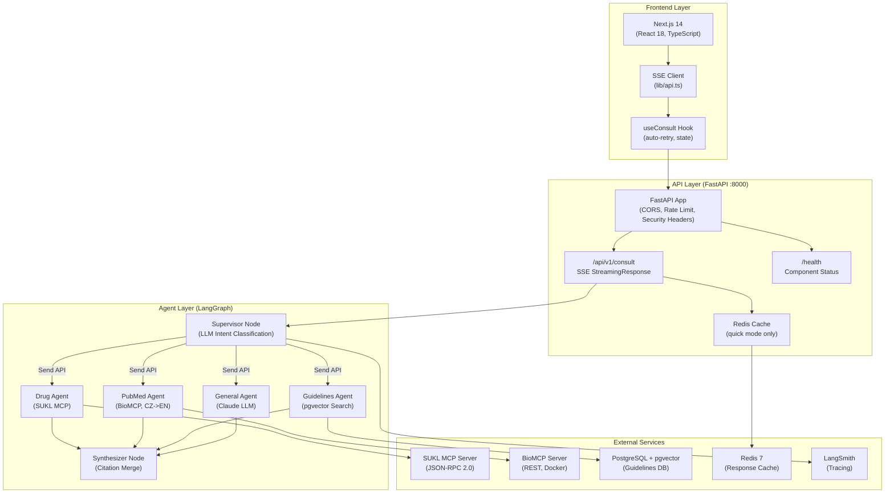
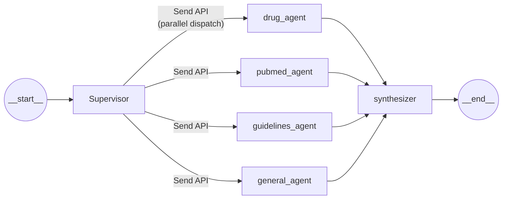
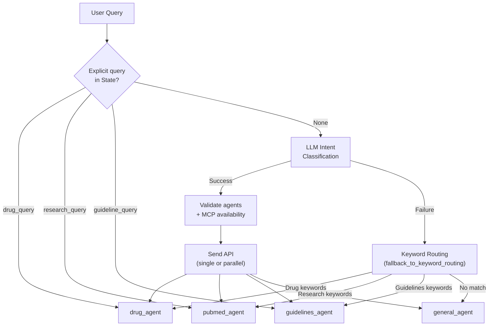
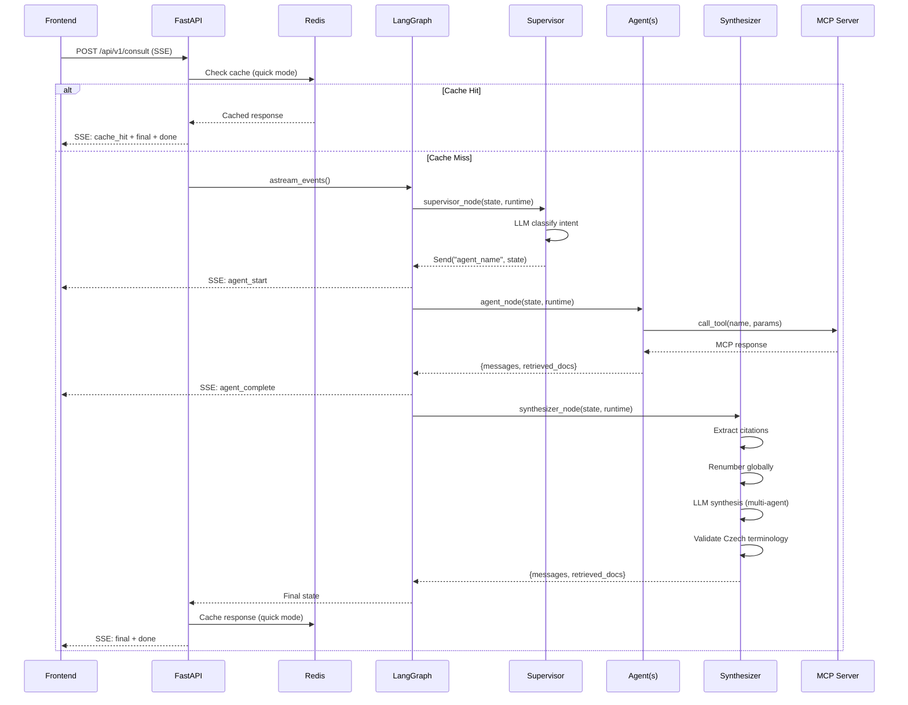
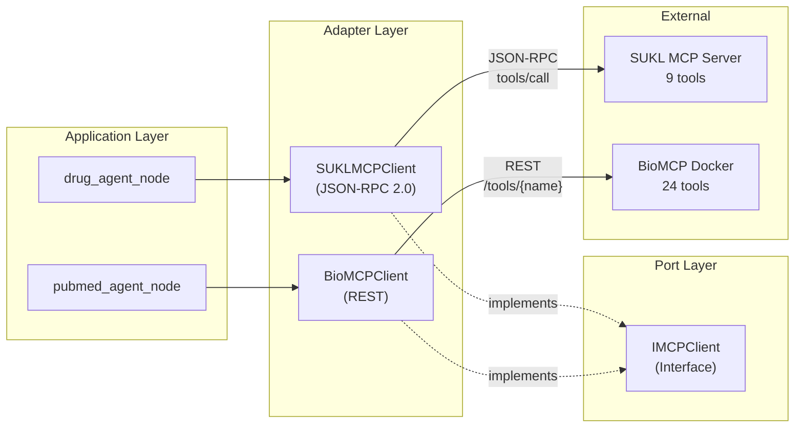

# Czech MedAI - Architecture Documentation

**Version**: 0.1.0 | **Last Updated**: 2026-02-15

## System Overview

Czech MedAI is a multi-agent AI assistant for Czech physicians, built on
LangGraph with a Next.js frontend and FastAPI bridge layer. The system provides
clinical decision support integrating SUKL, PubMed, and CLS JEP sources with
inline citations.

## High-Level Architecture



## LangGraph Agent Flow



### Routing Decision Flow



## Data Flow: Consult Request



## Component Details

### State Schema

```python
@dataclass
class State:
    messages: Annotated[list[AnyMessage], add_messages]
    next: Annotated[str, _keep_last] = "__end__"
    retrieved_docs: Annotated[list[Document], add_documents] = field(
        default_factory=list
    )
    drug_query: DrugQuery | None = None
    research_query: ResearchQuery | None = None
    guideline_query: GuidelineQuery | None = None
```

### Context Schema

```python
class Context(TypedDict, total=False):
    model_name: str              # default: claude-sonnet-4-5-20250929
    temperature: float           # default: 0.0
    langsmith_project: str
    user_id: str | None
    sukl_mcp_client: Any         # SUKLMCPClient
    biomcp_client: Any           # BioMCPClient
    openai_api_key: str          # for guidelines embeddings
    conversation_context: Any
    mode: Literal["quick", "deep"]
```

### Agent Nodes

| Node | Module | Responsibility | External Dependency |
|------|--------|---------------|-------------------|
| `supervisor` | `nodes/supervisor.py` | Intent classification, routing | Anthropic API |
| `drug_agent` | `nodes/drug_agent.py` | Czech pharmaceutical DB queries | SUKL MCP (JSON-RPC) |
| `pubmed_agent` | `nodes/pubmed_agent.py` | Biomedical research with CZ->EN | BioMCP (REST) |
| `guidelines_agent` | `nodes/guidelines_agent.py` | Clinical guideline search | PostgreSQL + pgvector |
| `general_agent` | `nodes/general_agent.py` | General medical Q&A | Anthropic API |
| `synthesizer` | `nodes/synthesizer.py` | Response merge, citations, terminology | Anthropic API |

### MCP Protocol Architecture



## Infrastructure

### Docker Compose Services

| Service | Image | Port | Purpose |
|---------|-------|------|---------|
| `api` | Custom (Dockerfile) | 8000 | FastAPI + LangGraph (4 uvicorn workers) |
| `redis` | redis:7-alpine | 6379 | Response cache (256MB, allkeys-lru) |
| `postgres` | ankane/pgvector | 5432 | Guidelines DB (semantic search) |

### Middleware Stack

```
Request
  -> Request ID (UUID v4, X-Request-ID header)
  -> Security Headers (HSTS, CSP, X-Frame-Options: DENY, nosniff)
  -> Process Time (X-Process-Time header)
  -> CORS (configurable origins)
  -> Rate Limiting (10 req/min per IP, slowapi)
  -> Route Handler
Response
```

### Security Measures

| Layer | Protection |
|-------|-----------|
| Input | SQL injection regex, XSS pattern blocking, 1000 char limit |
| Transport | HSTS, CSP, X-Frame-Options: DENY |
| Rate Limiting | 10 req/min per IP (slowapi) |
| Request Tracking | UUID per request (X-Request-ID) |
| MCP Clients | Content size limits (1MB total, 100KB per field) |
| Regex | Line-anchored patterns (ReDoS prevention) |
| Concurrency | Thread-safe ID generation (itertools.count) |
| Resources | Async context managers, 30s timeouts |

## Directory Structure

```
Langchain-benjamin/
├── frontend/                    # Next.js 14 (TypeScript)
│   ├── app/                     # App Router pages
│   │   ├── page.tsx             # Main chat interface
│   │   └── globals.css          # OKLCH design tokens
│   ├── components/              # React components (14 total)
│   │   ├── Omnibox.tsx          # Medical query input
│   │   ├── CitedResponse.tsx    # Response with inline citations
│   │   └── CitationBadge.tsx    # Citation [N] with HoverCard
│   ├── hooks/                   # Custom React hooks
│   │   ├── useConsult.ts        # API integration + retry
│   │   └── useRetry.ts          # Exponential backoff
│   ├── lib/                     # Utilities
│   │   ├── api.ts               # SSE streaming client
│   │   └── citations.ts         # Citation parsing
│   └── __tests__/               # Vitest + RTL + jest-axe
│
├── langgraph-app/               # Backend
│   ├── src/
│   │   ├── agent/
│   │   │   ├── graph.py         # State, Context, graph compilation
│   │   │   ├── nodes/           # Agent node modules
│   │   │   │   ├── supervisor.py
│   │   │   │   ├── drug_agent.py
│   │   │   │   ├── pubmed_agent.py
│   │   │   │   ├── guidelines_agent.py
│   │   │   │   ├── general_agent.py
│   │   │   │   ├── synthesizer.py
│   │   │   │   └── supervisor_prompts.py
│   │   │   ├── models/          # Pydantic models
│   │   │   ├── mcp/             # MCP client adapters
│   │   │   │   ├── adapters/    # SUKLMCPClient, BioMCPClient
│   │   │   │   └── domain/      # Ports, entities, exceptions
│   │   │   └── utils/           # Helpers (timeout, message, storage)
│   │   └── api/                 # FastAPI bridge
│   │       ├── main.py          # App, middleware, lifespan
│   │       ├── routes.py        # Endpoints (/health, /consult)
│   │       ├── schemas.py       # Request/response models
│   │       └── config.py        # Pydantic Settings
│   ├── tests/
│   │   ├── unit_tests/          # 442 tests
│   │   ├── integration_tests/
│   │   ├── quality/
│   │   └── conftest.py
│   ├── docker-compose.yml
│   ├── Dockerfile
│   └── langgraph.json
│
├── docs/                        # Generated documentation
├── specs/                       # Feature specifications
│   └── ROADMAP.md
└── .specify/                    # SpecKit configuration
    └── memory/constitution.md   # Project constitution v1.1.2
```

## Key Design Decisions

| Decision | Choice | Rationale |
|----------|--------|-----------|
| Orchestration | LangGraph (not LangChain chains) | Visual debugging, state management, parallel execution |
| Routing | Send API (not conditional edges) | Dynamic multi-agent dispatch, parallel execution |
| Frontend-Backend | SSE (not WebSocket) | Simpler protocol, unidirectional streaming sufficient |
| MCP Protocol | Per-server (JSON-RPC / REST) | Adapts to each server's native protocol |
| Caching | Redis (quick mode only) | Fast response for repeated queries |
| Guidelines DB | pgvector (not Pinecone/Weaviate) | Self-hosted, Docker-native, cost-effective |
| Keyword Routing | Single function (DRY) | `fallback_to_keyword_routing()` is the canonical source |
| Node Structure | Separate modules per agent | Independent testing, clear ownership (Principle V) |
