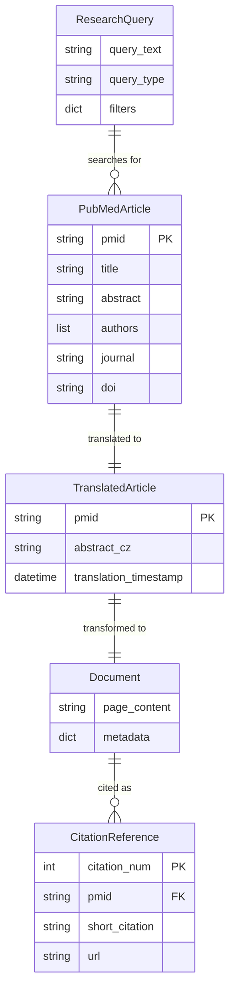

# Data Model: BioMCP PubMed Agent

**Feature**: 005-biomcp-pubmed-agent
**Date**: 2026-01-20
**Status**: Phase 1 Design

## Overview

This document defines the data entities for PubMed article search and retrieval with Czech ↔ English translation support.

---

## Core Entities

### 1. ResearchQuery

**Purpose**: Represents a user's research query with metadata for BioMCP search

**Fields**:
- `query_text` (str): Original user query text (Czech)
- `query_type` (Literal["search", "pmid_lookup"]): Type of research query
- `filters` (Optional[Dict[str, Any]]): Optional search filters

**Filter Keys** (optional):
- `date_range`: Tuple[str, str] - Start and end dates (ISO format)
- `article_type`: List[str] - Article types (e.g., ["clinical_trial", "review"])
- `journal`: str - Journal name filter
- `max_results`: int - Override default result limit (default: 5)

**Validation Rules**:
- `query_text` must not be empty
- `query_type` must be "search" or "pmid_lookup"
- If `query_type == "pmid_lookup"`, `query_text` must match PMID pattern (8-digit number)
- `filters.date_range` dates must be in ISO 8601 format (YYYY-MM-DD)

**Example**:
```python
ResearchQuery(
    query_text="Jaké jsou nejnovější studie o diabetu typu 2?",
    query_type="search",
    filters={"date_range": ("2023-01-01", "2026-01-20"), "max_results": 10}
)
```

---

### 2. PubMedArticle

**Purpose**: Represents a PubMed article with metadata for citation and display

**Fields** (from BioMCP response):
- `pmid` (str): PubMed unique identifier (8-digit)
- `title` (str): Article title (English)
- `abstract` (Optional[str]): Article abstract (English)
- `authors` (List[str]): Author names (Last, First format)
- `publication_date` (Optional[str]): Publication date (YYYY-MM-DD or YYYY-MM)
- `journal` (Optional[str]): Journal name
- `doi` (Optional[str]): Digital Object Identifier
- `pmc_id` (Optional[str]): PubMed Central ID (if free full-text available)

**Derived Fields** (computed):
- `pubmed_url` (str): f"https://pubmed.ncbi.nlm.nih.gov/{pmid}/"
- `pmc_url` (Optional[str]): f"https://www.ncbi.nlm.nih.gov/pmc/articles/{pmc_id}/" if pmc_id exists

**Validation Rules**:
- `pmid` must be 8-digit numeric string
- `title` must not be empty
- `authors` list can be empty (for older articles)
- `doi` must match DOI pattern if provided: `10.\d{4,9}/[-._;()/:A-Z0-9]+`

**Example**:
```python
PubMedArticle(
    pmid="12345678",
    title="Efficacy of Metformin in Type 2 Diabetes: A Randomized Trial",
    abstract="Background: Metformin is a first-line...",
    authors=["Smith, John", "Doe, Jane"],
    publication_date="2024-06-15",
    journal="New England Journal of Medicine",
    doi="10.1056/NEJMoa2401234",
    pmc_id="PMC10123456"
)
```

---

### 3. TranslatedArticle

**Purpose**: Extends PubMedArticle with Czech translation for user display

**Fields** (inherits all from PubMedArticle plus):
- `abstract_cz` (str): Czech translation of abstract
- `translation_timestamp` (datetime): When translation was generated

**Validation Rules**:
- `abstract_cz` must not be empty if `abstract` exists
- `translation_timestamp` must be in UTC

**Example**:
```python
TranslatedArticle(
    # ...all PubMedArticle fields...
    abstract_cz="Úvod: Metformin je lék první volby...",
    translation_timestamp=datetime(2026, 1, 20, 14, 30, 0, tzinfo=timezone.utc)
)
```

---

### 4. CitationReference

**Purpose**: Links a PubMed article to its citation number in conversation

**Fields**:
- `citation_num` (int): Sequential citation number [1], [2], [3], ...
- `pmid` (str): PubMed ID of cited article
- `short_citation` (str): Formatted short citation for inline display
- `full_citation` (str): Complete bibliographic entry
- `url` (str): PubMed URL for verification

**Derived Formats**:
- **Short Citation**: `{first_author_last_name} et al. ({year})`
- **Full Citation**: `{authors}. {title}. {journal}. {year}. PMID: {pmid}. {url}`

**Validation Rules**:
- `citation_num` must be positive integer
- `pmid` must match PubMed article
- `url` must be valid PubMed URL

**Example**:
```python
CitationReference(
    citation_num=1,
    pmid="12345678",
    short_citation="Smith et al. (2024)",
    full_citation="Smith J, Doe J. Efficacy of Metformin in Type 2 Diabetes. NEJM. 2024. PMID: 12345678. https://pubmed.ncbi.nlm.nih.gov/12345678/",
    url="https://pubmed.ncbi.nlm.nih.gov/12345678/"
)
```

---

## State Schema Extension

### State Dataclass (graph.py)

**Current State** (from Features 001-003):
```python
@dataclass
class State:
    messages: Annotated[list[AnyMessage], add_messages]
    next: str
    retrieved_docs: list[Document]
    drug_query: Optional[DrugQuery] = None  # Feature 003
```

**Extended State** (Feature 005 addition):
```python
@dataclass
class State:
    messages: Annotated[list[AnyMessage], add_messages]
    next: str
    retrieved_docs: list[Document]
    drug_query: Optional[DrugQuery] = None  # Feature 003
    research_query: Optional[ResearchQuery] = None  # Feature 005 ← NEW
```

**Rationale**:
- Parallel pattern to `drug_query` (Feature 003)
- Enables supervisor node to route research queries
- Type-safe field with Pydantic validation

---

## Document Transformation

### LangChain Document Format

**Purpose**: Standard format for citation tracking and LangSmith tracing

**Structure**:
```python
Document(
    page_content: str,  # Title + Czech abstract
    metadata: Dict[str, Any]  # Source, PMID, URL, authors, etc.
)
```

**page_content Format**:
```text
Title: {article.title}

Abstract (CZ): {abstract_cz}
```

**metadata Fields**:
```python
{
    "source": "PubMed",  # Constant identifier
    "pmid": str,  # 8-digit PubMed ID
    "url": str,  # https://pubmed.ncbi.nlm.nih.gov/{pmid}/
    "authors": str,  # Comma-separated author list
    "journal": str,  # Journal name
    "publication_date": str,  # YYYY-MM-DD
    "doi": Optional[str],  # Digital Object Identifier
    "pmc_id": Optional[str],  # PMC ID if available
    "pmc_url": Optional[str],  # PMC full-text URL
    "abstract_en": str,  # Original English abstract (for reference)
    "translation_timestamp": str  # ISO 8601 timestamp
}
```

**Example**:
```python
Document(
    page_content="""Title: Efficacy of Metformin in Type 2 Diabetes

Abstract (CZ): Úvod: Metformin je lék první volby pro léčbu diabetes mellitus typu 2...""",
    metadata={
        "source": "PubMed",
        "pmid": "12345678",
        "url": "https://pubmed.ncbi.nlm.nih.gov/12345678/",
        "authors": "Smith J, Doe J",
        "journal": "NEJM",
        "publication_date": "2024-06-15",
        "doi": "10.1056/NEJMoa2401234",
        "pmc_id": "PMC10123456",
        "pmc_url": "https://www.ncbi.nlm.nih.gov/pmc/articles/PMC10123456/",
        "abstract_en": "Background: Metformin is a first-line...",
        "translation_timestamp": "2026-01-20T14:30:00Z"
    }
)
```

---

## Relationships



---

## Helper Functions

### Query Classification

```python
def classify_research_query(message: str) -> ResearchQuery | None:
    """
    Classify user message as research query.

    Returns ResearchQuery if research intent detected, else None.
    """
```

**Logic**:
1. Check for research keywords: "studie", "výzkum", "pubmed", "článek", "literatura"
2. Check for PMID pattern: "PMID:12345678" or "pmid 12345678"
3. Extract date filters if present: "za poslední 2 roky", "od roku 2023"
4. Return ResearchQuery with detected parameters or None

### Article Transformation

```python
def article_to_document(
    article: PubMedArticle,
    czech_abstract: str
) -> Document:
    """
    Transform PubMedArticle + Czech translation to LangChain Document.
    """
```

**Logic**:
1. Format page_content: `f"Title: {title}\n\nAbstract (CZ): {czech_abstract}"`
2. Build metadata dict with all article fields + translation timestamp
3. Return Document with source="PubMed"

### Citation Formatting

```python
def format_citation(
    article: PubMedArticle,
    citation_num: int
) -> CitationReference:
    """
    Generate citation reference for article.
    """
```

**Logic**:
1. Extract first author last name: `article.authors[0].split(",")[0]`
2. Extract year from publication_date: `publication_date[:4]`
3. Create short_citation: `f"{first_author} et al. ({year})"`
4. Create full_citation with all bibliographic info
5. Return CitationReference with citation_num

---

## Validation Rules Summary

| Entity | Field | Rule |
|--------|-------|------|
| ResearchQuery | query_text | Not empty |
| ResearchQuery | query_type | Enum: "search" or "pmid_lookup" |
| ResearchQuery | filters.date_range | ISO 8601 dates (YYYY-MM-DD) |
| PubMedArticle | pmid | 8-digit numeric string |
| PubMedArticle | title | Not empty |
| PubMedArticle | doi | Match pattern: `10.\d{4,9}/[-._;()/:A-Z0-9]+` |
| TranslatedArticle | abstract_cz | Not empty if abstract exists |
| CitationReference | citation_num | Positive integer |
| CitationReference | url | Valid PubMed URL format |
| Document | metadata.source | Must be "PubMed" |
| Document | metadata.pmid | Must match PubMedArticle.pmid |

---

## Storage Considerations

**MVP (Feature 005)**:
- No persistent storage required (stateless queries)
- LangGraph checkpointing handles conversation state
- Translation cache in-memory (LRU cache, 100 entries)

**Post-MVP (Feature 018+)**:
- Redis cache for translations (persistent across sessions)
- PostgreSQL for citation history (user article library)
- Vector store for semantic article search (embeddings)

---

## Performance Considerations

### Memory Usage

- **ResearchQuery**: ~200 bytes
- **PubMedArticle**: ~2 KB (with abstract)
- **TranslatedArticle**: ~4 KB (+ Czech abstract)
- **Document**: ~5 KB (formatted content + metadata)
- **State with 5 articles**: ~25 KB

**Batch Limit**: Max 10 articles per query (default 5) to stay under 50 KB state size

### Data Flow Latency

1. **Query Classification**: <100ms (keyword matching)
2. **Translation CZ→EN**: ~1-2s (LLM call)
3. **BioMCP Search**: ~2-3s (PubMed API)
4. **Translation EN→CZ** (5 abstracts): ~1-2s (parallel LLM calls)
5. **Document Transformation**: <100ms (Python processing)

**Total**: 4-7s (within <5s target for 90% queries per SC-001)

---

## Code Generation Targets

**Models File**: `langgraph-app/src/agent/models/research_models.py`
```python
from pydantic import BaseModel, Field
from typing import Optional, Literal, Dict, Any, List
from datetime import datetime

class ResearchQuery(BaseModel): ...
class PubMedArticle(BaseModel): ...
class TranslatedArticle(PubMedArticle): ...  # Inherits fields
class CitationReference(BaseModel): ...
```

**State Extension**: `langgraph-app/src/agent/graph.py`
```python
from agent.models.research_models import ResearchQuery

@dataclass
class State:
    # ...existing fields...
    research_query: Optional[ResearchQuery] = None  # NEW
```

**Helper Functions**: `langgraph-app/src/agent/nodes/pubmed_agent.py`
```python
def classify_research_query(message: str) -> ResearchQuery | None: ...
def article_to_document(article: PubMedArticle, czech_abstract: str) -> Document: ...
def format_citation(article: PubMedArticle, citation_num: int) -> CitationReference: ...
```

---

**Status**: Data model design complete, ready for contract generation
